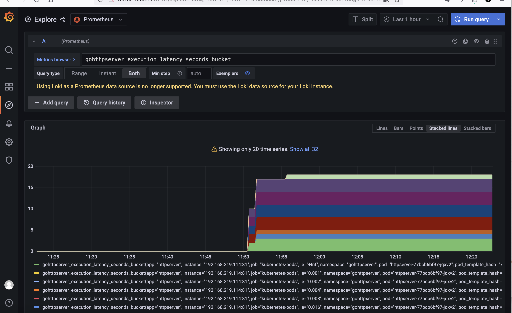

1. 为 HTTPServer 添加 0-2 秒的随机延时；
2. 为 HTTPServer 项目添加延时 Metric；
3. 将 HTTPServer 部署至测试集群，并完成 Prometheus 配置；
4. 从 Promethus 界面中查询延时指标数据；
5. （可选）创建一个 Grafana Dashboard 展现延时分配情况。

-----------------

1. 为HTTPServer添加0-2秒的随机延时

```go
// 在 main.go中做修改
// 导入 time 模块, 导入下面自定义的metric.go模块
// Main方法入口
import (
	"fmt"
	"cncamp/k8s_study/module10/metrics"
	"io"
	"log"
	"math/rand"
	"net/http"
	"os"
	"strconv"
	"strings"
	"time"
	"github.com/prometheus/client_golang/prometheus/promhttp"
)

func main() {
	println("环境正常")
        metrics.Register()
	mux := http.NewServeMux()

	// 功能1
	mux.HandleFunc("/requestAndResponse", requestAndResponse)

	// 功能2
	mux.HandleFunc("/getVersion", getVersion)

	// 功能3
	mux.HandleFunc("/ipAndStatus", ipAndStatus) //注册接口句柄

	// 功能4, 返回200，且执行前有0-2秒的随机延时
	mux.HandleFunc("/healthz", healthz) //注册接口句柄

	// 延时0-2秒
	mux.HandleFunc("/delay", delay)

	// 添加metrics
	mux.Handle("/metrics", promhttp.Handler())

	err := http.ListenAndServe(":81", mux) //监听空句柄，80端口被占用，使用81端口
	if nil != err {
		log.Fatal(err) //显示错误日志
	}
}

// 添加0-2秒的随机延时功能
func delay(w http.ResponseWriter, r *http.Request) {
	timer := metrics.NewTimer()
	defer timer.ObserveTotal()
	randInt := rand.Intn(2000)
	time.Sleep(time.Millisecond * time.Duration(randInt))
	w.Write([]byte(fmt.Sprintf("<h1>%d<h1>", randInt)))
}
```


2. 为HTTPServer 项目添加延时 Metrics，自定义Metrics

```go
// 自定义一个 metrics 模块
package metrics

import (
	"fmt"
	"github.com/prometheus/client_golang/prometheus"
	"time"
)

func Register() {
	err := prometheus.Register(functionLatency)
	if err != nil {
		fmt.Println(err)
	}
}

const (
	MetricsNamespace = "gohttpserver"
)

func NewTimer() *ExecutionTimer {
	return NewExecutionTimer(functionLatency)
}

var (
	functionLatency = CreateExecutionTimeMetric(MetricsNamespace, "Time spent.")
)

func NewExecutionTimer(histo *prometheus.HistogramVec) *ExecutionTimer {
	now := time.Now()
	return &ExecutionTimer{histo: histo, start: now, last: now}
}

func (t *ExecutionTimer) ObserveTotal() {
	(*t.histo).WithLabelValues("total").Observe(time.Now().Sub(t.start).Seconds())
}

func CreateExecutionTimeMetric(namespace string, help string) *prometheus.HistogramVec {
	return prometheus.NewHistogramVec(
		prometheus.HistogramOpts{
			Namespace: namespace,
			Name:      "execution_latency_seconds",
			Help:      help,
			Buckets:   prometheus.ExponentialBuckets(0.001, 2, 15),
		}, []string{"step"},
	)
}

type ExecutionTimer struct {
	histo *prometheus.HistogramVec
	start time.Time
	last  time.Time
}
```


3. 将 HTTPServer 部署至测试集群，并完成 Prometheus 配置

3.1 本地重新构建httpserver镜像推送至hub.docker.com

```shell

$ export GOPROXY="https://goproxy.cn"
$ go mod init
go: /home/minwang/go/src/cncamp/k8s_study/module10/go.mod already exists
$ go mod tidy
go: downloading github.com/prometheus/client_golang v1.17.0
go: downloading github.com/prometheus/client_model v0.4.1-0.20230718164431-9a2bf3000d16
go: downloading google.golang.org/protobuf v1.31.0
go: downloading github.com/prometheus/common v0.44.0
go: downloading github.com/beorn7/perks v1.0.1
go: downloading github.com/cespare/xxhash/v2 v2.2.0
go: downloading github.com/prometheus/procfs v0.11.1
go: downloading golang.org/x/sys v0.11.0
go: downloading github.com/davecgh/go-spew v1.1.1
go: downloading github.com/matttproud/golang_protobuf_extensions v1.0.4
go: downloading github.com/google/go-cmp v0.5.9
go: downloading github.com/golang/protobuf v1.5.3

$ GOARCH=amd64 go build -o bin/amd64/httpserver main.go

# 构建镜像gohttpserver
$ vim Dockerfile
FROM ubuntu
ENV MY_SERVICE_PORT=81
LABEL author=helenwami
ADD bin/amd64/httpserver /gohttpserver
RUN echo 'httpserver is serving...'
EXPOSE 81
ENTRYPOINT /gohttpserver

$ sudo docker build -t gohttpserver:v1.3 .
Sending build context to Docker daemon  12.55MB
Step 1/7 : FROM ubuntu
 ---> ba6acccedd29
Step 2/7 : ENV MY_SERVICE_PORT=81
 ---> Using cache
 ---> baedc9778d10
Step 3/7 : LABEL author=helenwami
 ---> Using cache
 ---> 83b32503f19c
Step 4/7 : ADD bin/amd64/httpserver /gohttpserver
 ---> 4448a5ca91d8
Step 5/7 : RUN echo 'httpserver is serving...'
 ---> Running in 92cb74f1ca3a
httpserver is serving...
Removing intermediate container 92cb74f1ca3a
 ---> 0ca13ef5820f
Step 6/7 : EXPOSE 81
 ---> Running in 9928f8f56db5
Removing intermediate container 9928f8f56db5
 ---> ea60ae788f08
Step 7/7 : ENTRYPOINT /gohttpserver
 ---> Running in 6355f77ba550
Removing intermediate container 6355f77ba550
 ---> f342ddba8ed5
Successfully built f342ddba8ed5
Successfully tagged gohttpserver:v1.3

$ sudo docker login   
$ sudo docker tag gohttpserver:v1.3 helenwami/gohttpserver:v1.3
$ docker push helenwami/gohttpserver:v1.3
The push refers to repository [docker.io/helenwami/gohttpserver]
5610a0836778: Pushed
9f54eef41275: Layer already exists
v1.3: digest: sha256:37b729f0bf539ee56cbfcc95a38ba21f87ec6d5427a72de426ae7b85d072f80e size: 740


```


3.2 修改httpserver-dep.yaml 文件中httpserver的image版本为v1.1，添加prometheus配置，重新部署httpserver到kubernetes集群

````shell
$ kubectl apply -f httpserver-dep.yaml
```
  template:
    metadata:
      labels:
        app: httpserver
      annotations:
        prometheus.io/port: server-port
        prometheus.io/scrape: "true"
    spec:
      containers:
      - image: helenwami/gohttpserver:v1.3
        name: gohttpserver
        ports:
        - name: server-port
          containerPort: 81
```

# 验证
$ curl http://httpserver.test/delay -v
*   Trying 10.111.136.12:80...
* TCP_NODELAY set
* Connected to httpserver.test (10.111.136.12) port 80 (#0)
> GET /delay HTTP/1.1
> Host: httpserver.test
> User-Agent: curl/7.68.0
> Accept: */*
>
* Mark bundle as not supporting multiuse
< HTTP/1.1 200 OK
< Date: Thu, 19 Oct 2023 15:38:07 GMT
< Content-Length: 12
< Content-Type: text/html; charset=utf-8
<
* Connection #0 to host httpserver.test left intact
<h1>1612<h1>root@master:~#

# 自定义metrics "gohttpserver_execution_latency_seconds" 已成功记录
$ curl http://httpserver.test/metrics -v
*   Trying 10.111.136.12:80...
* TCP_NODELAY set
* Connected to httpserver.test (10.111.136.12) port 80 (#0)
> GET /metrics HTTP/1.1
> Host: httpserver.test
> User-Agent: curl/7.68.0
> Accept: */*
>
* Mark bundle as not supporting multiuse
< HTTP/1.1 200 OK
< Content-Type: text/plain; version=0.0.4; charset=utf-8
< Date: Fri, 20 Oct 2023 04:00:38 GMT
< Transfer-Encoding: chunked
<
# HELP go_gc_duration_seconds A summary of the pause duration of garbage collection cycles.
# TYPE go_gc_duration_seconds summary
go_gc_duration_seconds{quantile="0"} 2.0319e-05
go_gc_duration_seconds{quantile="0.25"} 2.8792e-05
go_gc_duration_seconds{quantile="0.5"} 0.000109253
go_gc_duration_seconds{quantile="0.75"} 0.000116367
go_gc_duration_seconds{quantile="1"} 0.000188282
go_gc_duration_seconds_sum 0.000494425
go_gc_duration_seconds_count 6
# HELP go_goroutines Number of goroutines that currently exist.
# TYPE go_goroutines gauge
go_goroutines 7
# HELP go_info Information about the Go environment.
# TYPE go_info gauge
go_info{version="go1.20.5"} 1
# HELP go_memstats_alloc_bytes Number of bytes allocated and still in use.
# TYPE go_memstats_alloc_bytes gauge
go_memstats_alloc_bytes 2.122288e+06
# HELP go_memstats_alloc_bytes_total Total number of bytes allocated, even if freed.
# TYPE go_memstats_alloc_bytes_total counter
go_memstats_alloc_bytes_total 8.818848e+06
# HELP go_memstats_buck_hash_sys_bytes Number of bytes used by the profiling bucket hash table.
# TYPE go_memstats_buck_hash_sys_bytes gauge
go_memstats_buck_hash_sys_bytes 4204
# HELP go_memstats_frees_total Total number of frees.
# TYPE go_memstats_frees_total counter
go_memstats_frees_total 26118
# HELP go_memstats_gc_sys_bytes Number of bytes used for garbage collection system metadata.
# TYPE go_memstats_gc_sys_bytes gauge
go_memstats_gc_sys_bytes 7.771176e+06
# HELP go_memstats_heap_alloc_bytes Number of heap bytes allocated and still in use.
# TYPE go_memstats_heap_alloc_bytes gauge
go_memstats_heap_alloc_bytes 2.122288e+06
# HELP go_memstats_heap_idle_bytes Number of heap bytes waiting to be used.
# TYPE go_memstats_heap_idle_bytes gauge
go_memstats_heap_idle_bytes 4.34176e+06
# HELP go_memstats_heap_inuse_bytes Number of heap bytes that are in use.
# TYPE go_memstats_heap_inuse_bytes gauge
go_memstats_heap_inuse_bytes 3.489792e+06
# HELP go_memstats_heap_objects Number of allocated objects.
# TYPE go_memstats_heap_objects gauge
go_memstats_heap_objects 1531
# HELP go_memstats_heap_released_bytes Number of heap bytes released to OS.
# TYPE go_memstats_heap_released_bytes gauge
go_memstats_heap_released_bytes 4.005888e+06
# HELP go_memstats_heap_sys_bytes Number of heap bytes obtained from system.
# TYPE go_memstats_heap_sys_bytes gauge
go_memstats_heap_sys_bytes 7.831552e+06
# HELP go_memstats_last_gc_time_seconds Number of seconds since 1970 of last garbage collection.
# TYPE go_memstats_last_gc_time_seconds gauge
go_memstats_last_gc_time_seconds 1.69777438563481e+09
# HELP go_memstats_lookups_total Total number of pointer lookups.
# TYPE go_memstats_lookups_total counter
go_memstats_lookups_total 0
# HELP go_memstats_mallocs_total Total number of mallocs.
# TYPE go_memstats_mallocs_total counter
go_memstats_mallocs_total 27649
# HELP go_memstats_mcache_inuse_bytes Number of bytes in use by mcache structures.
# TYPE go_memstats_mcache_inuse_bytes gauge
go_memstats_mcache_inuse_bytes 4800
# HELP go_memstats_mcache_sys_bytes Number of bytes used for mcache structures obtained from system.
# TYPE go_memstats_mcache_sys_bytes gauge
go_memstats_mcache_sys_bytes 15600
# HELP go_memstats_mspan_inuse_bytes Number of bytes in use by mspan structures.
# TYPE go_memstats_mspan_inuse_bytes gauge
go_memstats_mspan_inuse_bytes 82880
# HELP go_memstats_mspan_sys_bytes Number of bytes used for mspan structures obtained from system.
# TYPE go_memstats_mspan_sys_bytes gauge
go_memstats_mspan_sys_bytes 97920
# HELP go_memstats_next_gc_bytes Number of heap bytes when next garbage collection will take place.
# TYPE go_memstats_next_gc_bytes gauge
go_memstats_next_gc_bytes 4.369216e+06
# HELP go_memstats_other_sys_bytes Number of bytes used for other system allocations.
# TYPE go_memstats_other_sys_bytes gauge
go_memstats_other_sys_bytes 1.022988e+06
# HELP go_memstats_stack_inuse_bytes Number of bytes in use by the stack allocator.
# TYPE go_memstats_stack_inuse_bytes gauge
go_memstats_stack_inuse_bytes 557056
# HELP go_memstats_stack_sys_bytes Number of bytes obtained from system for stack allocator.
# TYPE go_memstats_stack_sys_bytes gauge
go_memstats_stack_sys_bytes 557056
# HELP go_memstats_sys_bytes Number of bytes obtained from system.
# TYPE go_memstats_sys_bytes gauge
go_memstats_sys_bytes 1.7300496e+07
# HELP go_threads Number of OS threads created.
# TYPE go_threads gauge
go_threads 8
# HELP gohttpserver_execution_latency_seconds latency_records
# TYPE gohttpserver_execution_latency_seconds histogram
gohttpserver_execution_latency_seconds_bucket{step="total",le="0.001"} 0
gohttpserver_execution_latency_seconds_bucket{step="total",le="0.002"} 0
gohttpserver_execution_latency_seconds_bucket{step="total",le="0.004"} 0
gohttpserver_execution_latency_seconds_bucket{step="total",le="0.008"} 0
gohttpserver_execution_latency_seconds_bucket{step="total",le="0.016"} 0
gohttpserver_execution_latency_seconds_bucket{step="total",le="0.032"} 0
gohttpserver_execution_latency_seconds_bucket{step="total",le="0.064"} 0
gohttpserver_execution_latency_seconds_bucket{step="total",le="0.128"} 0
gohttpserver_execution_latency_seconds_bucket{step="total",le="0.256"} 0
gohttpserver_execution_latency_seconds_bucket{step="total",le="0.512"} 1
gohttpserver_execution_latency_seconds_bucket{step="total",le="1.024"} 1
gohttpserver_execution_latency_seconds_bucket{step="total",le="2.048"} 3
gohttpserver_execution_latency_seconds_bucket{step="total",le="4.096"} 3
gohttpserver_execution_latency_seconds_bucket{step="total",le="8.192"} 3
gohttpserver_execution_latency_seconds_bucket{step="total",le="16.384"} 3
gohttpserver_execution_latency_seconds_bucket{step="total",le="+Inf"} 3
gohttpserver_execution_latency_seconds_sum{step="total"} 3.628479412
gohttpserver_execution_latency_seconds_count{step="total"} 3
# HELP process_cpu_seconds_total Total user and system CPU time spent in seconds.
# TYPE process_cpu_seconds_total counter
process_cpu_seconds_total 0.21
# HELP process_max_fds Maximum number of open file descriptors.
# TYPE process_max_fds gauge
process_max_fds 1.048576e+06
# HELP process_open_fds Number of open file descriptors.
# TYPE process_open_fds gauge
process_open_fds 10
# HELP process_resident_memory_bytes Resident memory size in bytes.
# TYPE process_resident_memory_bytes gauge
process_resident_memory_bytes 1.3602816e+07
# HELP process_start_time_seconds Start time of the process since unix epoch in seconds.
# TYPE process_start_time_seconds gauge
process_start_time_seconds 1.69777359481e+09
# HELP process_virtual_memory_bytes Virtual memory size in bytes.
# TYPE process_virtual_memory_bytes gauge
process_virtual_memory_bytes 1.191735296e+09
# HELP process_virtual_memory_max_bytes Maximum amount of virtual memory available in bytes.
# TYPE process_virtual_memory_max_bytes gauge
process_virtual_memory_max_bytes 1.8446744073709552e+19
# HELP promhttp_metric_handler_requests_in_flight Current number of scrapes being served.
# TYPE promhttp_metric_handler_requests_in_flight gauge
promhttp_metric_handler_requests_in_flight 1
# HELP promhttp_metric_handler_requests_total Total number of scrapes by HTTP status code.
# TYPE promhttp_metric_handler_requests_total counter
promhttp_metric_handler_requests_total{code="200"} 16
promhttp_metric_handler_requests_total{code="500"} 0
promhttp_metric_handler_requests_total{code="503"} 0
* Connection #0 to host httpserver.test left intact
````


3.3 安装prometheus和grafana

```shell
# 安装helm
$ sudo apt-get install helm

# 为helm配置grafana仓库
$ helm repo add grafana https://grafana.github.io/helm-charts
"grafana" has been added to your repositories

# 安装loki-stack
$ helm repo update
$ helm upgrade --install loki grafana/loki-stack --set grafana.enabled=true,prometheus.enabled=true,prometheus.alertmanager.persistentVolume.enabled=false,prometheus.server.persistentVolume.enabled=false

Release "loki" does not exist. Installing it now.
W1019 19:48:59.619555 2149678 warnings.go:70] policy/v1beta1 PodSecurityPolicy is deprecated in v1.21+, unavailable in v1.25+
W1019 19:48:59.621144 2149678 warnings.go:70] policy/v1beta1 PodSecurityPolicy is deprecated in v1.21+, unavailable in v1.25+
W1019 19:48:59.696404 2149678 warnings.go:70] policy/v1beta1 PodSecurityPolicy is deprecated in v1.21+, unavailable in v1.25+
W1019 19:48:59.696934 2149678 warnings.go:70] policy/v1beta1 PodSecurityPolicy is deprecated in v1.21+, unavailable in v1.25+
NAME: loki
LAST DEPLOYED: Thu Oct 19 19:48:58 2023
NAMESPACE: default
STATUS: deployed
REVISION: 1
NOTES:
The Loki stack has been deployed to your cluster. Loki can now be added as a datasource in Grafana.

$ helm pull grafana/loki-stack
$ tar -xvf loki-stack-*.tgz

$ cd loki-stack
grep -rl "rbac.authorization.k8s.io/v1beta1" .
./charts/grafana/templates/_helpers.tpl
./charts/filebeat/examples/upgrade/Makefile
./charts/prometheus/templates/_helpers.tpl

$ grep -rl "rbac.authorization.k8s.io/v1beta1" . | xargs sed -i 's/rbac.authorization.k8s.io\/v1beta1/rbac.authorization.k8s.io\/v1/g'
$ cd ..
$ helm upgrade --install loki ./loki-stack --set grafana.enabled=true,prometheus.enabled=true,prometheus.alertmanager.persistentVolume.enabled=false,prometheus.server.persistentVolume.enabled=false
See http://docs.grafana.org/features/datasources/loki/ for more detail.
# 查看loki-stack是否安装成功

$ kubectl get pods
NAME                                            READY   STATUS             RESTARTS   AGE
loki-0                                          1/1     Running            0          37m
loki-grafana-747548bb7c-rj5d7                   2/2     Running            0          45s
loki-kube-state-metrics-5c6b9ddd4f-z7spq        0/1     ImagePullBackOff   0          37m
loki-prometheus-alertmanager-7d5bdfcb7b-scdh4   2/2     Running            0          37m
loki-prometheus-node-exporter-wlrdr             1/1     Running            0          37m
loki-prometheus-pushgateway-7cdf755958-lrtbf    1/1     Running            0          37m
loki-prometheus-server-6764f67456-jnwxd         2/2     Running            0          37m
loki-promtail-dj4km                             1/1     Running            0          37m

# k8s.gcr.io/kube-state-metrics/kube-state-metrics:v2.3.0 镜像拉取失败
# 从国内源下载镜像，并修改tag
$ docker pull registry.cn-wulanchabu.aliyuncs.com/moge1/kube-state-metrics:v2.3.0
v2.3.0: Pulling from moge1/kube-state-metrics
2df365faf0e3: Pull complete
bbb17218abce: Pull complete
Digest: sha256:caf70de8662486ff35ac74e8631e348981faad5dd0c4e370742a141b38acd720
Status: Downloaded newer image for registry.cn-wulanchabu.aliyuncs.com/moge1/kube-state-metrics:v2.3.0
registry.cn-wulanchabu.aliyuncs.com/moge1/kube-state-metrics:v2.3.0

$ docker tag registry.cn-wulanchabu.aliyuncs.com/moge1/kube-state-metrics:v2.3.0 k8s.gcr.io/kube-state-metrics/kube-state-metrics:v2.3.0

# 上述方法不生效，找到镜像源文件，直接修改镜像拉取地址
$ vi loki-stack/charts/prometheus/charts/kube-state-metrics/values.yaml
# Default values for kube-state-metrics.
prometheusScrape: true
image:
  repository: registry.cn-wulanchabu.aliyuncs.com/moge1/kube-state-metrics
  tag: v2.3.0
  pullPolicy: IfNotPresent
  
$ helm upgrade --install loki ./loki-stack --set grafana.enabled=true,prometheus.enabled=true,prometheus.alertmanager.persistentVolume.enabled=false,prometheus.server.persistentVolume.enabled=false

$ kubectl get pod
NAME                                            READY   STATUS    RESTARTS   AGE
loki-0                                          1/1     Running   0          149m
loki-grafana-747548bb7c-rj5d7                   2/2     Running   0          113m
loki-kube-state-metrics-5c8db948bc-hxbgw        1/1     Running   0          29s
loki-prometheus-alertmanager-7d5bdfcb7b-scdh4   2/2     Running   0          149m
loki-prometheus-node-exporter-wlrdr             1/1     Running   0          149m
loki-prometheus-pushgateway-7cdf755958-lrtbf    1/1     Running   0          149m
loki-prometheus-server-6764f67456-jnwxd         2/2     Running   0          149m
loki-promtail-dj4km                             1/1     Running   0          149m

# loki stack相关的组件，如Prometheus，grafana已经被安装在default的namespace下面了
```


4. 从 Promethus 界面中查询延时指标数据

```shell
# 为了方便在本地访问Prometheus的Dashbord，将集群中的Service loki-prometheus-server 设置为NodePort类型

root@master:~# kubectl get svc
NAME                            TYPE        CLUSTER-IP       EXTERNAL-IP   PORT(S)           AGE
envoy                           NodePort    10.109.140.215   <none>        10000:31651/TCP   57d
kubernetes                      ClusterIP   10.96.0.1        <none>        443/TCP           63d
loki                            ClusterIP   10.97.69.71      <none>        3100/TCP          156m
loki-grafana                    ClusterIP   10.110.250.146   <none>        80/TCP            156m
loki-headless                   ClusterIP   None             <none>        3100/TCP          156m
loki-kube-state-metrics         ClusterIP   10.109.43.231    <none>        8080/TCP          156m
loki-memberlist                 ClusterIP   None             <none>        7946/TCP          156m
loki-prometheus-alertmanager    ClusterIP   10.107.236.231   <none>        80/TCP            156m
loki-prometheus-node-exporter   ClusterIP   None             <none>        9100/TCP          156m
loki-prometheus-pushgateway     ClusterIP   10.97.202.171    <none>        9091/TCP          156m
loki-prometheus-server          ClusterIP   10.108.16.50     <none>        80/TCP            156m

$ kubectl edit svc loki-prometheus-server

$ kubectl get svc loki-prometheus-server
NAME                     TYPE       CLUSTER-IP     EXTERNAL-IP   PORT(S)        AGE
loki-prometheus-server   NodePort   10.108.16.50   <none>        80:31342/TCP   158m
```


5. 创建一个 Grafana Dashboard 展现延时分配情况

```shell
# 暴露grafana端口
$ kubectl edit svc loki-grafana
$ kubectl get svc loki-grafana
NAME           TYPE       CLUSTER-IP       EXTERNAL-IP   PORT(S)        AGE
loki-grafana   NodePort   10.110.250.146   <none>        80:31191/TCP   4h6m

# 查找grafana登录密码
# kubectl get secret loki-grafana -oyaml -n default
apiVersion: v1
data:
  admin-password: SHpudzVTZDFLSHVDRERtZ2tFaHVRVENQM2lzQTE2NlpuT2VsSHJCSA==
  admin-user: YWRtaW4=
  ldap-toml: ""
kind: Secret
metadata:
  annotations:
    meta.helm.sh/release-name: loki
    meta.helm.sh/release-namespace: default
  creationTimestamp: "2023-10-19T11:48:59Z"
  labels:
    app.kubernetes.io/instance: loki
    app.kubernetes.io/managed-by: Helm
    app.kubernetes.io/name: grafana
    app.kubernetes.io/version: 8.3.5
    helm.sh/chart: grafana-6.43.5
  name: loki-grafana
  namespace: default
  resourceVersion: "9212672"
  uid: 02702535-5149-4f2e-ada6-12a4564b9c8a
type: Opaque

Hznw5Sd1KHuCDDmgkEhuQTCP3isA166ZnOelHrBH
admin
```

在grafana configuration中配置prometheus为Data Source，可以用explore去测试数据是否正常抓取并展示




